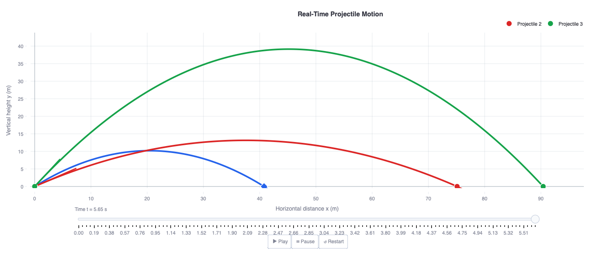

# Interactive Physics Lab

A modular, interactive simulation platform built with Streamlit for exploring core concepts across multiple domains of physics.  
Designed to bridge **analytical theory, numerical modelling, and physical intuition** through real-time visualisation.

---

## Overview

The Interactive Physics Lab is structured as a **multi-domain computational environment**, enabling users to experiment with physical systems through parameter-driven simulations.

Rather than isolated demos, the project is organised as a **scalable framework** where each module represents a distinct area of physics, unified under a consistent interface and simulation logic.

---
## Simulation Preview



*Real-time projectile motion simulation showing simultaneous trajectories under varying initial conditions, with time evolution control and dynamic visualisation.*


## Physics Domains

### Mechanics
- Projectile Motion Explorer  
- Oscillatory Systems (in development)

### Electrodynamics
- Electric Field & Equipotential Visualizer  
- Lorentz Force Simulation (planned)

### Nuclear Physics
- Radioactive Decay & Nuclear Transformation (in development)

### Atomic Physics
- Energy Level Transitions & Photon Emission (in development)

### Modern Physics
- Quantum Interference & Double-Slit Simulation (planned)

### Fluid & Multiphysics
- Particle Transport in Fluid Flow (experimental module)

---

## Core Features

- **Real-time simulation engine** with play/pause control  
- **Interactive parameter space exploration** via sliders and controls  
- **Dynamic visualisation**:
  - Trajectories  
  - Field maps (heatmaps, field lines)  
  - Time evolution of systems  
- **Quantitative outputs**:
  - Derived physical quantities (e.g. range, energy, field strength)  
  - Probe-based local measurements  
- **Modular architecture** for extending simulations across domains  

---

## Educational & Research Context

This project is developed with two complementary goals:

### Teaching & Conceptual Understanding
- Provides an interactive environment for students to build intuition beyond static equations  
- Links mathematical expressions directly to visual outcomes  
- Encourages exploratory learning through parameter manipulation  

### Computational & Research Development
- Acts as a testbed for numerical modelling of physical systems  
- Supports extension into more advanced simulations (e.g. coupled systems, quantum models)  
- Reflects a broader interest in **computational physics, simulation design, and scientific visualisation**  


## Run Locally

```bash
python3 -m venv venv
source venv/bin/activate
pip install -r requirements.txt
python -m streamlit run app.py

```
## Project Structure
```
interactive-physics-lab/
├── app.py                # main Streamlit app
├── requirements.txt      # Python dependencies
├── README.md             # project documentation
├── modules/              # physics simulation modules
      ├── mechanics/ 
      ├── electrodynamics/ 
      ├── nuclear/
      ├── atomic_physics/
      ├── modern_physics/

├── utils/                # helper functions
├── docs/                 # documentation and images
└── assets/               # visual assets
```

## Live App
[Open the app](https://interactive-physics-lab-be6d52c2tihyhu84xdgwwn.streamlit.app/)
```


```
## Author
  Cherian P Ittyipe
  Physics & Astrophysics Graduate
  Focus: Cosmology • Computational Physics • Scientific Simulation
  GitHub: https://github.com/Cherian-pi